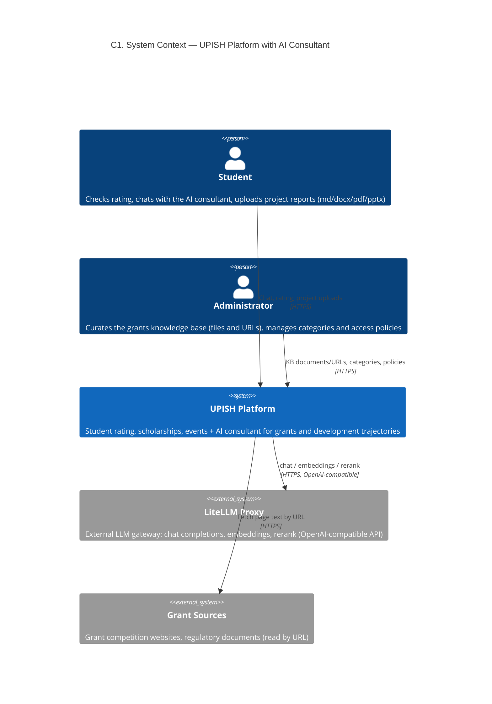
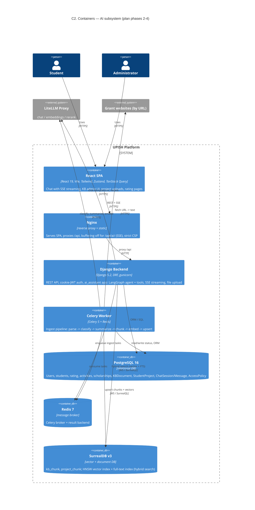

# AI Consultant Subsystem — C1/C2 Architecture

Scope: the AI subsystem of the UPISH platform (plan phases 2–4: knowledge base,
student projects, agent chat), shown in the context of the whole system.
Notation: C4 model (C1 = System Context, C2 = Container), Mermaid C4 diagrams.

## C1 — System Context

## C2 — Containers

## Key data flows

1. **KB ingest (admin file/URL):** API stores `KBDocument` (Postgres) → Celery task
   extracts text (docx/pdf/pptx/md/HTML via trafilatura) → LLM classifier assigns
   `GrantCategory` slugs + summary → chunking → embeddings via LiteLLM → upsert into
   SurrealDB `kb_chunk` → status `ready` in Postgres.
2. **Student project ingest:** same pipeline into `project_chunk` with `student_id`
   metadata; project categories link the project to the grant taxonomy, which enables
   automatic "project -> relevant grants" matching.
3. **Agent chat (SSE):** user message -> `ChatMessage` (Postgres) -> LangGraph react
   agent with student context card; tools read rating/analytics/activities from
   Postgres and search grants via SurrealDB hybrid search + LiteLLM rerank; answer
   tokens stream back over SSE; assistant message persisted.

## Advantages, top to bottom

- **UI:** live SSE streaming, session history, quick prompts, project attachment
  directly in chat; admin KB management without touching code; processing statuses
  visible (`pending -> ready/failed`).
- **API & security:** cookie-JWT + CSRF, central `AccessPolicy` flag for AI access,
  audit log events, chat throttling (30/hour per user) for LLM cost control,
  strict upload validation (format, size, zip-bomb checks); uploaded files are
  never publicly served.
- **Agent:** answers are grounded in real data — tools read the actual rating,
  analytics and activities from Postgres and grants from the vector store, so the
  model does not invent numbers or deadlines; system prompt carries the student
  context card plus their project summaries for personal trajectories; LangGraph
  tool-calling is transparent and easy to extend.
- **Knowledge pipeline:** any source (file or URL) -> parse -> LLM classify +
  summarize -> chunk -> embed, fully automated; hybrid retrieval (HNSW vector +
  full-text BM25) with a reranker yields relevant grants instead of fuzzy keyword
  matches; one category taxonomy links grants and student projects.
- **Analytics:** the agent uses the same rating/analytics services as the
  dashboards (place, trend, averages, distributions, attendance), so advice like
  "how to raise my rating" is computed from real metrics, not generic tips.
- **Infrastructure:** heavy ingest is async (Celery), API stays responsive;
  SurrealDB covers documents + vectors + FTS in one engine; LiteLLM is a single
  gateway — model/provider changes need no code changes; the whole stack spins up
  with `docker compose up`, CI runs without external services (mocks).
