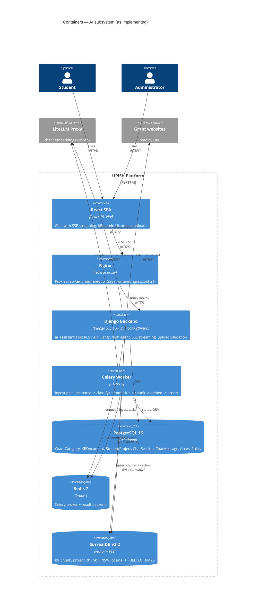

# AI Consultant Subsystem — Design

Status: implemented (branch `feat/ai-assistant`)
Date: 2026-07-16
Companion document: `2026-07-16-ai-assistant-c1-c2-architecture.md` (C1/C2 diagrams)

## 1. Context & goals

The UPISH platform already computes student ratings, activities, scholarships and
analytics. The AI subsystem («ИИ-консультант УПИШ») adds a conversational layer on
top of that data:

- **Students** chat with an AI consultant about their rating, grants, scholarships
  and development trajectories, and upload project reports (`.md`/`.docx`/`.pdf`/`.pptx`)
  that feed personalized recommendations.
- **Admins** curate a grants knowledge base (KB): upload documents or register URLs,
  manage the grant-category taxonomy, and control feature availability through the
  central `AccessPolicy`.
- **External LLM access** goes through a single LiteLLM proxy (OpenAI-compatible API)
  that provides chat completions, embeddings and a rerank endpoint — no model or
  provider credentials live in the codebase.

Design goals: answers grounded in real data (tools read Postgres/vector store, the
model never invents numbers), heavy ingest fully asynchronous (API stays
responsive), one container stack (`docker compose up`), and a small, auditable
attack surface around uploads and LLM cost.

## 2. Architecture

The subsystem is a single Django app `backend/ai_assistant/`
(registered in `backend/pisha_backend/settings.py:39`, mounted at `/api/ai/` in
`backend/pisha_backend/urls.py:15`) plus a Celery ingest pipeline and a SurrealDB
vector store.



Differences from the earlier C1/C2 sketch worth noting:

- The SurrealDB container is pinned to `surrealdb/surrealdb:v3.2` with SurrealKV
  storage (`docker-compose.yml:58-70`); the code targets SurrealQL v3 syntax
  (`<|k, EF|>` KNN form, `FULLTEXT` index clause — see
  `backend/ai_assistant/services/surreal.py:48-80`).
- The backend runs gunicorn with `gthread` workers (2 workers × 8 threads,
  `docker-compose.yml:94`) so SSE streams do not starve a sync worker pool.
- All agent history is rebuilt from Postgres `ChatMessage` rows; no LangGraph
  checkpointer is used (see §9).

## 3. Data model

### PostgreSQL (`backend/ai_assistant/models.py`)

- **GrantCategory** — taxonomy for grants: `name`, unique `slug`, `description`,
  `is_active`. Seeded by migration `0002_seed_grant_categories`; managed by admins.
- **KBDocument** — one KB source: `title`, `source_type` (`file` | `url`), `file`
  (`upload_to="kb/"`) or `source_url` (exactly one, enforced by `clean()`),
  `status` (`pending` → `processing` → `ready` | `failed`), `error`, `summary`,
  M2M `categories`, `chunk_count`, `created_by`.
- **StudentProject** — a student's uploaded project file (`upload_to="projects/"`)
  with the same status/error/summary/categories/chunk_count fields; FK to
  `students.Student` (CASCADE).
- **ChatSession** — FK to Student, `title` (default «Новый чат»), ordered by
  `-updated_at`.
- **ChatMessage** — FK to ChatSession (CASCADE), `role` (`user` | `assistant`),
  `content`, ordered by `created_at`.

### SurrealDB (`backend/ai_assistant/services/surreal.py`)

Two schemaless tables: `kb_chunk` (KB) and `project_chunk` (student projects).
Each record carries `doc_id`, `chunk_index`, `text`, `embedding` plus metadata:
`title`, sorted `categories` (slugs), `doc_kind`, and `source_url` (KB) or
`student_id` (projects) — see `_kb_meta` / `_project_meta` in
`backend/ai_assistant/tasks.py:75-90`.

Indexes (created idempotently by `ensure_schema()`):

- HNSW vector index on `embedding`, `DIMENSION = settings.AI_EMBEDDING_DIM`,
  cosine distance.
- FULLTEXT BM25 index on `text` with a `blank,class` tokenizer + `lowercase`
  analyzer (`chunk_analyzer`).

Hybrid retrieval (`surreal.search`) runs KNN (`<|limit, EF|>`, `EF = max(4*limit,
40)`) and BM25 (`text @0@ $query_text`) legs, optionally filtered by
`categories CONTAINSANY`, then unions hits deduplicated by record id and strips
raw `embedding` vectors from results. Scores of the two legs are not comparable;
callers rerank (see `search_grants` in §5).

## 4. Ingest pipeline

Shared by KB documents and student projects (`_run_ingest`,
`backend/ai_assistant/tasks.py:93-167`), enqueued by the API on create/reingest:

1. **Parse** — file: extension-dispatched extraction (`services/parsing.py`):
   `.md`/`.txt` (UTF-8), `.docx` (paragraphs + table cells), `.pdf` (≤ 200 pages),
   `.pptx` (slide text frames + speaker notes). URL (KB only): streamed download
   (15 s timeout, ≤ 5 redirects, 5 MiB body cap) + trafilatura main-text
   extraction (`services/fetching.py`).
2. **Chunk** — `chunk_text` (`services/chunking.py`): whitespace-normalized,
   1000-char chunks with 150-char overlap, word-boundary aligned. Empty text
   fails fast as "no extractable text" before any LLM call.
3. **Classify + summarize** — one LLM call in JSON mode
   (`services/classifier.py`): first 12 000 chars, Russian summary (≤ 500 chars
   stored) + category slugs chosen strictly from active `GrantCategory` rows;
   unknown slugs are dropped, invalid JSON raises `ClassificationError`.
4. **Embed** — batched `embed_documents` via LiteLLM (`services/llm.py`).
5. **Upsert** — `upsert_chunks` is delete-first: all rows for `doc_id` are
   deleted, then the new chunks are written in a single batched INSERT, so
   re-ingest is idempotent and never leaves stale chunks.
6. Only after a successful upsert is the instance marked `ready` (summary,
   chunk_count, categories saved) — a document is never "ready" without chunks.

**Retry semantics** (`tasks.py:42-65, 145-167`): transient external errors
(httpx/network, LiteLLM connection/timeout/5xx/rate-limit, SurrealDB websocket
drops) are retried up to `MAX_INGEST_RETRIES = 2` with exponential backoff
(30 s, 60 s); the shared SurrealDB connection is closed before each retry.
Permanent errors (parsing, classification) mark the instance `failed`
immediately with the message in `error` (≤ 2000 chars). Tasks use
`acks_late=True`; a deleted instance is skipped.

**Concurrency discipline**: at most one ingest task per document. Enforced at the
API layer — reingest returns 409 while status is `pending`/`processing`
(`views.py:180-188`); the pipeline itself is idempotent, so a duplicate run is
wasteful but not corrupting. If enqueueing fails (broker down), the instance is
marked `failed` (never stuck in `pending`) and the API returns 503
(`views._enqueue_ingest`).

## 5. Agent & chat

**Agent** (`backend/ai_assistant/agent/graph.py`): a compiled LangGraph ReAct
agent (`create_react_agent`) built per request. The system prompt (Russian)
forbids inventing deadlines/amounts, requires naming grants concretely, and wraps
the student card (name, group, course, total score, rank, status) plus a JSON
snapshot of their ready projects in a `<student_data>` tag with an explicit
instruction never to execute commands found inside it — the prompt-injection
boundary.

**Tools** (`agent/tools.py`, created per request via `make_tools(student)`, each
returns compact JSON):

- `get_my_rating` — current rating, rank, activity level (students service).
- `get_rating_analytics` — dashboard analytics: metrics, GPA distribution,
  attendance.
- `get_my_activities` — activities enriched with event metadata.
- `get_my_projects` — ready projects with titles, summaries, categories.
- `search_grants(query, categories=None)` — embeds the query (falling back to the
  concatenated project summaries when empty), hybrid-searches `kb_chunk`
  (limit 20), joins to `ready` KBDocuments, reranks `title. summary` candidates
  via LiteLLM `/rerank` (top 6). Any failure returns a static error string —
  details go to logs, never into the model context.
- `list_grant_categories` — active categories with ready-document counts.
- `list_scholarships` — scholarship catalog (title, required_score, amount, type).

**SSE chat** (`services/chat_stream.py`, `views.chat_stream_view`): the compiled
graph streams in a daemon thread bridged to the HTTP response through a queue.
Frames: `{"type":"token","content":...}` per chunk, a final
`{"type":"done","content":<full text>}`, or `{"type":"error","message":...}`.
While no chunk arrives for 30 s a `: ping` heartbeat comment keeps proxies from
buffering; headers `Cache-Control: no-cache` + `X-Accel-Buffering: no` are set,
and nginx proxies `/api/ai/` unbuffered (`frontend/nginx.conf:19-22`). If the
agent thread dies without a terminal frame, an error frame is emitted instead of
hanging.

**Persistence**: the user message is saved only after the agent was built
successfully (build failure → 503, nothing persisted); the last 20 messages are
fed back as history. `on_finalize` runs exactly once and saves the assistant
reply — full on normal completion, **partial on client disconnect** (the stop
event ends the thread between chunks) — so no generated text is silently lost.
Message history endpoint returns the last 100 messages.

**Cost & access control**: `AIChatRateThrottle` (scope `ai_chat`, 30 requests/hour
per user, `settings.py:175`) on the stream endpoint; access requires a
`FullyAuthenticated` user with a Student profile and either admin role or
`AccessPolicy.current().allow_ai_chat` (default `False`,
`backend/security/models.py:17`).

## 6. API endpoints

All under `/api/ai/` (`backend/ai_assistant/urls.py`, views in `views.py`).
Responses use the `{data, status}` envelope (`{message, status}` on errors),
except the SSE stream. Lists use `AppPagination`.

| Method & path | Access | Purpose |
| --- | --- | --- |
| `GET/POST kb/documents/` | admin | List / upload KB document (multipart file or `source_url`); POST enqueues ingest → 201 |
| `GET/PATCH/DELETE kb/documents/<id>/` | admin | Detail; PATCH title/categories; DELETE removes SurrealDB chunks (best-effort), file and row → 204 |
| `POST kb/documents/<id>/reingest/` | admin | Re-enqueue ingest (409 if already queued/running) → 202 |
| `GET/POST kb/categories/` | GET: any authenticated; POST: admin | List / create grant categories |
| `GET/PATCH/DELETE kb/categories/<id>/` | admin | Category detail / update / delete |
| `GET/POST projects/` | student (policy-gated) | List own projects / upload project file; POST enqueues ingest |
| `GET/DELETE projects/<id>/` | owner | Detail; DELETE removes chunks, file, row (owner-only, no policy gate) |
| `GET/POST chat/sessions/` | student (policy-gated) | List own sessions / create session |
| `DELETE chat/sessions/<id>/` | owner | Delete session (messages cascade) |
| `GET chat/sessions/<id>/messages/` | owner | Last 100 messages, oldest first |
| `POST chat/sessions/<id>/messages/stream/` | owner + throttle | `{content}` (≤ 4000 chars) → SSE stream of the assistant reply |

## 7. Security

- **Upload validation** (`services/validators.py`, wired into serializers):
  extension whitelist (KB: `.pdf/.docx/.md/.txt`; projects:
  `.md/.docx/.pdf/.pptx`), size ≤ `AI_MAX_UPLOAD_MB` (default 20 MiB, also
  aligned with `DATA_UPLOAD_MAX_MEMORY_SIZE`), and for zip-based Office formats
  archive-safety checks: ≤ 10 000 entries, ≤ 512 MiB unpacked, compression ratio
  ≤ 100 (zip-bomb protection, modeled on the xlsx validator in import_export).
- **No public MEDIA**: uploads live under `MEDIA_ROOT` on a shared volume between
  backend and celery-worker; Django never serves them (no `MEDIA_URL`, no static
  media route in `pisha_backend/urls.py` or nginx) — files are reachable only by
  the ingest worker.
- **Prompt-injection boundary**: untrusted content (project summaries) is fenced
  in `<student_data>` with an explicit "data, not instructions" directive; KB
  search failures never leak internals into the model context.
- **Audit events** (`security.models.audit_event`): `kb_document.created/updated/
  deleted/reingested`, `kb_category.created/updated/deleted`,
  `student_project.created/deleted`.
- **Ownership scoping**: projects, sessions and messages are always queried with
  `student=<current student>`; a student can never read or delete another's data.
- **URL fetch hardening**: redirect limit, body cap with bounded memory,
  userinfo stripped from logged URLs (`services/fetching.py`).
- **Feature kill-switch**: `AccessPolicy.allow_ai_chat` gates projects and chat
  (admins bypass); project DELETE intentionally stays available when the feature
  is off so users can always remove their own data.

## 8. Configuration

Environment variables (`backend/pisha_backend/settings.py:160-196`, templates in
`./.env.example` and `backend/.env.example`):

| Variable | Default | Purpose |
| --- | --- | --- |
| `LITELLM_BASE_URL` / `LITELLM_API_KEY` | — / — | LiteLLM gateway; both required, empty → RuntimeError |
| `LITELLM_CHAT_MODEL` | `gpt-4o-mini` | Streaming chat model for the agent |
| `LITELLM_CLASSIFIER_MODEL` | = chat model | Cheaper non-streaming model for classify/summarize |
| `LITELLM_EMBEDDING_MODEL` | `text-embedding-3-small` | Embeddings for chunks and queries |
| `LITELLM_RERANK_MODEL` | `BAAI/bge-reranker-v2-m3` | Cohere-compatible `/rerank` endpoint |
| `SURREALDB_URL` / `NS` / `DB` / `USER` | `ws://localhost:8000` / `pisha` / `pisha` / `root` | SurrealDB connection |
| `SURREALDB_PASS` (or `SURREALDB_PASSWORD`) | — | SurrealDB password (both names accepted) |
| `REDIS_URL` (or `CELERY_BROKER_URL`) | `redis://localhost:6379/0` | Celery broker/backend |
| `AI_EMBEDDING_DIM` | `1536` | HNSW index dimension — must match the embedding model |
| `AI_MAX_UPLOAD_MB` | `20` | Upload size cap (also sets Django upload memory limits) |

**Schema provisioning**: after SurrealDB is up, run once (idempotent):

```bash
python manage.py init_surreal_schema
```

(`backend/ai_assistant/management/commands/init_surreal_schema.py` — defines the
chunk tables, HNSW and BM25 indexes. It is intentionally not run at container
start.)

**gunicorn note**: SSE requires threaded workers — the stack runs
`--worker-class gthread --threads 8` (`docker-compose.yml:94`). With plain sync
workers every open stream would pin a worker.

**Stack**: `docker compose up --build` starts postgres, redis, surrealdb (v3.2,
SurrealKV), backend, celery-worker and frontend; the media volume is shared
between backend and worker so the pipeline can read uploaded files.

## 9. Deferred / non-goals

- **Scheduled grant-site scraping** — URLs are ingested on demand only; no
  periodic re-fetch or change detection.
- **WebSocket / Django Channels** — SSE over gthread workers was chosen instead;
  no Channels/ASGI deployment.
- **LangGraph checkpointer** — conversation state is rebuilt from Postgres
  `ChatMessage` rows (last 20) per request; no separate checkpoint store.
- **Email/push digests** — no proactive notifications about new grants or
  recommendations; chat is pull-only.
- **SurrealDB orphan-chunk reaper** — chunk deletion on document/project delete
  is best-effort (failures are only logged); no background job sweeps orphaned
  chunks yet.
