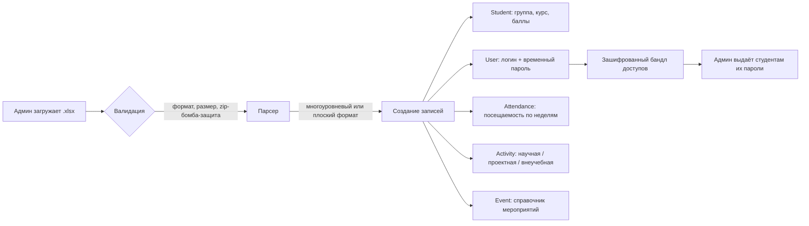
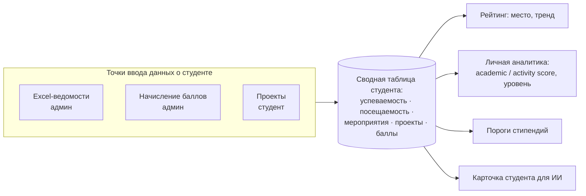
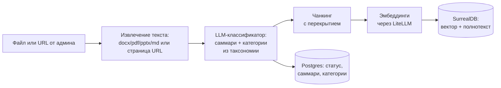
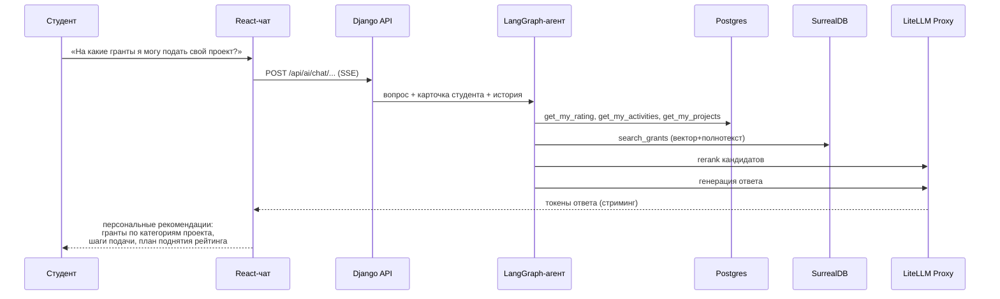
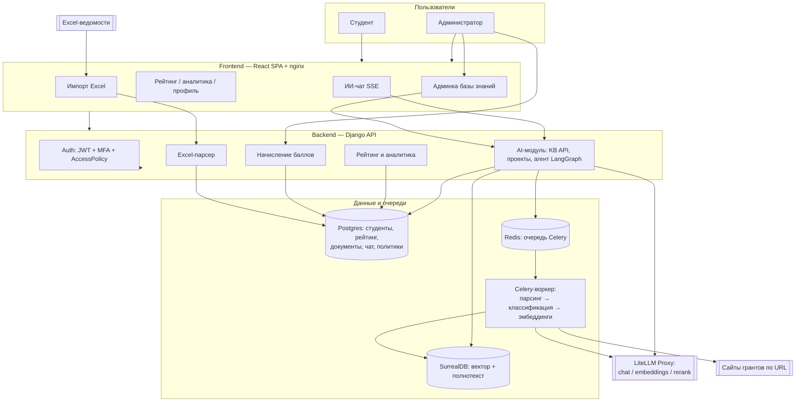

# Платформа УПИШ — сквозная схема работы системы

От загрузки существующих данных до персональных рекомендаций ИИ-консультанта.

Документ описывает целевую работу системы end-to-end: точки входа, пути данных,
обработку, принятие решений. В конце — честный статус реализации по компонентам.

---

## 1. Система в одном абзаце

Платформа оцифровывает рейтингово-стипендиальную работу университета: существующие
данные о студентах загружаются из Excel-таблиц и автоматически распарсиваются в
структурированную базу; далее рейтинг ведётся уже внутри системы (начисление баллов
администратором, мероприятия, аналитика). Поверх этих данных работает ИИ-консультант:
он знает реальный рейтинг студента, его мероприятия и проекты, располагает векторной
базой знаний о грантах, стипендиях и дотациях — и выдаёт персональные рекомендации:
какие гранты доступны, как подать проект, как поднять рейтинг, какую траекторию
развития выбрать.

Центральный принцип данных: **всё сводится в одну таблицу**. Оценки успеваемости,
участие в мероприятиях и проекты, в которых участвует студент, консолидируются в
единой записи — и уже из неё питаются рейтинг, аналитика, стипендиальные решения
и ИИ-консультант.

## 2. Акторы и внешние системы

- **Студент** — видит свой рейтинг, посещаемость, мероприятия, стипендии; загружает
  проекты; общается с ИИ-консультантом.
- **Администратор** — импортирует Excel-рейтинги, начисляет баллы, наполняет базу
  знаний грантов (файлы и ссылки), управляет категориями и политиками доступа.
- **LiteLLM Proxy** (внешний) — единый шлюз к LLM: генерация ответов (chat),
  эмбеддинги (embeddings), реранк (rerank). Смена моделей не требует изменений кода.
- **Источники грантов** (внешние) — сайты конкурсов и нормативные документы;
  администратор добавляет их в базу знаний ссылкой, система извлекает текст сама.

## 3. Точка входа: аутентификация и роли

1. Пользователь логинится парой «группа + пароль» (+ MFA-код при настроенном TOTP).
2. Первый вход — по временному паролю из импорта: система требует смены пароля.
3. Администратор дополнительно подтверждает TOTP (обязательная двухфакторка).
4. Сессия — JWT в HttpOnly-куках (access 15 мин, refresh 7 дней, ротация),
   CSRF double-submit. Роль (`admin` / `student`) определяет доступные разделы.
5. Доступ студентов к отдельным разделам регулируется централизованно через
   `AccessPolicy` (флаги: имена в рейтинге, логи баллов, уведомления, AI-чат).

## 4. Стартовое наполнение: импорт существующих данных из Excel

Ключевой принцип: **никакого ручного переноса данных**. Уже существующие ведомости
загружаются как есть — система распарсивает их сама.

`POST /api/import/excel` (только администратор), файл `.xlsx` до 10 МБ.
Поддерживаются два формата (определяются автоматически):

- **Многоуровневый заголовок** — «живые» ведомости: группа / ФИО / баллы /
  посещаемость по неделям / научная / проектная / внеучебная деятельность +
  отдельный лист «перечень мероприятий».
- **Плоская таблица** — произвольные колонки через карту синонимов (рус/англ).

Результат импорта: полностью заведённые студенты с историей баллов и посещаемости,
готовые учётные записи (пароль выдаётся один раз через зашифрованный credential-бандл)
и справочник мероприятий. Все действия импорта попадают в аудит-лог.

## 5. Операционная работа: рейтинг ведётся внутри системы

После стартового импорта Excel нужен только для архива — текущий рейтинг наполняется
внутри платформы:

- **Начисление баллов** (`POST /api/scoring/`, админ): журнал `ScoringLog`
  (тип активности, баллы) + участники; `total_score` студента обновляется атомарно.
- **Мероприятия**: справочник `Event` (название, категория, уровень, дата, баллы);
  участие студента — `Activity` (научная / проектная / внеучебная, баллы).
- **Рейтинг** (`GET /api/rating`): место, баллы, тренд, академический и активностный
  скоры, статистика (моё место / топ / среднее); имена скрываются по политике.
- **Аналитика** (`/api/dashboard/*`): метрики, распределение оценок, тренды
  посещаемости — основа для решений администрации.
- **Стипендии** (`GET /api/scholarships/`): каталог с `required_score` — порогом
  рейтинга для назначения; решение о назначении принимается по прозрачным данным.

### 5.1. Ввод данных и единая сводная таблица студента

**Точки ввода** — у каждого блока таблицы есть своё место ввода данных о студенте:

| Блок таблицы | Кто вводит | Где вводится |
|---|---|---|
| Успеваемость (средний балл) | Администратор | Excel-импорт ведомостей |
| Посещаемость по неделям | Администратор | Excel-импорт ведомостей |
| Мероприятия и баллы | Администратор | Начисление баллов внутри системы |
| Проекты студента | **Студент** | Загрузка в чате / профиле (md/docx/pdf/pptx) |
| Рейтинговый балл (итог) | Система | Пересчитывается автоматически |

**Общая таблица** уже отражена в интерфейсе: профиль студента показывает чипы
«Рейтинг · Баллы · Средний балл · Посещаемость», блок «Успеваемость»
(Средний балл / Активность / Общий рейтинг) и статистику (Текущий ранг, Всего
баллов, Академические, Активность, Уровень активности). API профиля
(`GET /api/students/<id>/profile/`) возвращает ту же таблицу данными:
`totalScore`, `averageScore`, `attendances` (по неделям) + `attendancePct`,
`activities` (научная / проектная / внеучебная + баллы), `projectCount`.

**Аналитика по каждому студенту** выстраивается из этой же таблицы: место в
рейтинге и тренд, разложение баллов на академическую и активностную части, уровень
активности (высокая / средняя / низкая), процент посещаемости, количество проектов.
Та же таблица — контекст ИИ-консультанта: он рассуждает на реальных цифрах
конкретного студента, а не на усреднённых советах.

## 6. База знаний грантов: наполнение и индексация

Администратор наполняет базу знаний двумя способами: **загрузка файла**
(pdf / docx / md / txt) или **добавление ссылки** (URL страницы конкурса).
Дальше документ проходит автоматический пайплайн (Celery, асинхронно):

- **Таксономия категорий** (управляется админом): академические и социальные
  стипендии, научные гранты, проектные и стартап-гранты, конкурсы и олимпиады,
  молодёжные программы и дотации, международные программы.
- Статус обработки виден в интерфейсе: `pending → processing → ready / failed`
  (с текстом ошибки и кнопкой повторного запуска).
- Поиск по базе — **гибридный**: векторный (смысл) + полнотекстовый (термины),
  затем **реранкер** LiteLLM выбирает самое релевантное.

## 7. Проекты студентов

Информацию о проектах загружают **сами студенты**: отчёт или описание проекта
(md / docx / pdf / pptx) — прямо из чата или профиля. Каждый проект попадает в
сводную таблицу студента (см. 5.1) и проходит тот же автоматический пайплайн:
парсинг → классификатор определяет категории дотаций, под которые подходит проект,
→ саммари → векторный индекс. Единая таксономия связывает **проект ↔ подходящие
гранты** автоматически.

## 8. ИИ-консультант: от вопроса к решению

Чат (стриминг ответа по SSE) работает на агенте LangGraph с инструментами,
читающими **реальные данные**, а не «знания» модели:

| Инструмент | Что даёт агенту |
|---|---|
| `get_my_rating` | место в рейтинге, баллы, тренд, сравнение со средним |
| `get_rating_analytics` | распределения и метрики дашборда |
| `get_my_activities` | мероприятия и достижения студента с баллами |
| `get_my_projects` | загруженные проекты: саммари, категории |
| `search_grants` | гибридный поиск по базе знаний + реранк → топ грантов |
| `list_scholarships` | каталог стипендий с порогами `required_score` |

В системный контекст подставляется карточка студента (группа, курс, баллы, место,
статус). Модель отвечает только на основе инструментов: не выдумывает дедлайны
и суммы, называет гранты по именам, даёт конкретные шаги.

## 9. Сквозной сценарий end-to-end

1. **Онбординг**: админ загружает существующие Excel-ведомости → студенты и их
   история в системе, доступы выданы.
2. **Наполнение знаний**: админ загружает положения о грантах и ссылки на
   конкурсы → база знаний проиндексирована и размечена по категориям.
3. **Текущая работа**: админ начисляет баллы за активности внутри системы;
   рейтинг пересчитывается; все данные сходятся в сводной таблице студента,
   по каждому студенту строится личная аналитика.
4. **Студент**: сам загружает проект → система определяет его категории → в чате
   получает: подходящие гранты и стипендии (с учётом своего рейтинга и порогов),
   инструкцию по подаче, траекторию «что делать, чтобы попасть в топ».
5. **Решения**: студент — куда подаваться и что улучшать; администрация —
   назначение стипендий по данным рейтинга и прозрачной аналитике.

## 10. Главная схема системы

## 11. Статус реализации

| Компонент | Статус |
|---|---|
| Auth (JWT, MFA, смена пароля), AccessPolicy, аудит | ✅ работает |
| Excel-импорт рейтинга (два формата, credential-бандл) | ✅ работает |
| Начисление баллов, рейтинг, аналитика, стипендии | ✅ работает |
| Инфраструктура ИИ (Celery, Redis, SurrealDB, LiteLLM) | ✅ готово (фаза 1) |
| База знаний: модели, парсеры, классификатор, пайплайн, API | ✅ готово, 133 теста (фазы 2–3) |
| Проекты студентов: загрузка, пайплайн, API | ✅ готово (фаза 3) |
| ИИ-агент с инструментами + SSE-чат (backend) | 🚧 следующая фаза (фаза 4) |
| Фронтенд: чат-UI, админка базы знаний, загрузка проектов | 🚧 фаза 5 (сейчас чат — заглушка) |

## 12. Безопасность и права

- Роли admin/student; студент видит только свои данные (рейтинг обезличен по политике).
- Доступ к ИИ-чату и загрузке проектов включается централизованно (`allow_ai_chat`).
- Загрузки валидируются (формат, размер, защита от zip-бомб); файлы нигде публично
  не раздаются — их читает только backend.
- Троттлинг чата (30 запросов/час) защищает бюджет LLM; все операции администратора
  с базой знаний пишутся в аудит-лог.
- Секреты (LiteLLM, БД) — только в переменных окружения; Postgres, Redis, SurrealDB
  не публикуются наружу (только внутренняя docker-сеть, вход через nginx).
